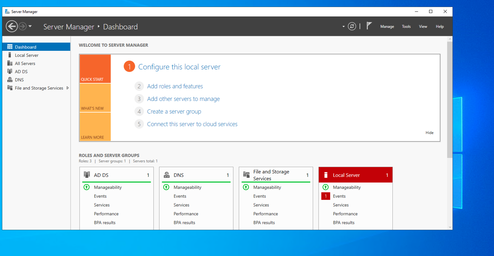

# Active Directory Enterprise Lab — Azure Cloud
### NexaCore Technologies | nexacore.local

A fully functional enterprise-grade Active Directory environment
built on Microsoft Azure, simulating a real-world corporate
IT infrastructure for a managed services company.

---

## Project Overview

| Detail | Value |
|--------|-------|
| Company | NexaCore Technologies |
| Domain | nexacore.local |
| Location | Tampa, FL (simulated) |
| Cloud Platform | Microsoft Azure |
| DC OS | Windows Server 2022 Datacenter |
| Client OS | Windows 11 Pro |
| Total Users | 19 |
| Departments | 6 |

---

## Architecture

- **Azure Resource Group:** NexaCore-RG
- **Virtual Network:** NexaCore-VNet (10.0.0.0/16)
- **Subnet:** Corporate-Subnet (10.0.1.0/24)
- **Domain Controller:** DC-01 (10.0.1.10 — static private IP)
- **Client VM:** JEFFPC (domain joined)
- **NSG:** RDP restricted to admin IP only

---

## Azure Infrastructure



The lab runs on two Azure VMs inside a dedicated VNet.
DC-01 holds a static private IP at 10.0.1.10 and acts as
the DNS server for the entire subnet. CLIENT-01's NIC DNS
is pointed directly at DC-01 to enable domain resolution
and joining.


---

## Organizational Structure
```
nexacore.local
└── NexaCore
    ├── IT          → Users / Computers / Groups
    ├── Finance     → Users / Computers / Groups
    ├── HR          → Users / Computers / Groups
    ├── Sales       → Users / Computers / Groups
    ├── Operations  → Users / Computers / Groups
    ├── Legal       → Users / Computers / Groups
    ├── Admin Accounts
    ├── ServiceAccounts
    └── Servers
```


---

## User Accounts (19 Total)

### IT Department
| Full Name | Username | Title |
|-----------|----------|-------|
| Alex Torres | atorres | IT Manager |
| Brian Nguyen | bnguyen | Systems Administrator |
| Carlos Patel | cpatel | Help Desk Technician |
| Diana Kim | dkim | Network Engineer |

### Finance Department
| Full Name | Username | Title |
|-----------|----------|-------|
| Sandra Williams | swilliams | Finance Manager |
| Tom Brown | tbrown | Accountant |
| Uma Davis | udavis | Financial Analyst |

### HR Department
| Full Name | Username | Title |
|-----------|----------|-------|
| Laura Garcia | lgarcia | HR Manager |
| Mike Wilson | mwilson | HR Specialist |
| Nina Moore | nmoore | Recruiter |

### Sales Department
| Full Name | Username | Title |
|-----------|----------|-------|
| Ryan Johnson | rjohnson | Sales Manager |
| Emily Martinez | emartinez | Account Executive |
| Frank Anderson | fanderson | Sales Representative |
| Grace Thomas | gthomas | Sales Representative |

### Operations Department
| Full Name | Username | Title |
|-----------|----------|-------|
| Henry Jackson | hjackson | Operations Manager |
| Iris White | iwhite | Operations Analyst |
| James Harris | jharris | Logistics Coordinator |

### Legal Department
| Full Name | Username | Title |
|-----------|----------|-------|
| Karen Lewis | klewis | Legal Counsel |
| Oscar Clark | oclark | Paralegal |


---

## Admin & Service Accounts

### IT Admin Accounts (Privileged — separate from daily use)
| Username | Role | Group |
|----------|------|-------|
| adm-atorres | Domain Administrator | Domain Admins |
| adm-bnguyen | Server Administrator | Server Operators |
| adm-cpatel | Server Administrator | Server Operators |
| adm-dkim | Server Administrator | Server Operators |

### Service Account
| Username | Purpose | Password Policy |
|----------|---------|----------------|
| svc-backup | Backup operations (Veeam) | Never expires |

---

## Security Groups

| Group | Members | Scope |
|-------|---------|-------|
| GRP-IT | atorres, bnguyen, cpatel, dkim | Global Security |
| GRP-Finance | swilliams, tbrown, udavis | Global Security |
| GRP-HR | lgarcia, mwilson, nmoore | Global Security |
| GRP-Sales | rjohnson, emartinez, fanderson, gthomas | Global Security |
| GRP-Operations | hjackson, iwhite, jharris | Global Security |
| GRP-Legal | klewis, oclark | Global Security |

---

## Group Policy Configuration


### NexaCore - Base Security Policy
**Linked to:** Domain root (applies to all users and computers)

| Setting | Value |
|---------|-------|
| Minimum password length | 12 characters |
| Password complexity | Enabled |
| Maximum password age | 90 days |
| Account lockout threshold | 5 attempts |
| Lockout duration | 30 minutes |
| Reset lockout counter | 30 minutes |

---

### NexaCore - IT Policy
**Linked to:** OU=IT

| Setting | Value |
|---------|-------|
| Allow log on via Remote Desktop | GRP-IT, Administrators |
| Allow log on locally | GRP-IT, Administrators |

*IT staff require elevated local and remote access for
system administration and helpdesk support.*

---

### NexaCore - Finance Policy
**Linked to:** OU=Finance

| Setting | Value |
|---------|-------|
| Removable storage access | Denied |
| Audit object access | Success and Failure |
| Audit logon events | Success and Failure |

*Finance handles sensitive financial data. USB restriction
prevents data exfiltration. Audit logging supports
compliance requirements.*

---

### NexaCore - HR Policy
**Linked to:** OU=HR

| Setting | Value |
|---------|-------|
| Removable storage access | Denied |
| Control Panel access | Prohibited |

*HR manages PII and employee records. Lockdown reduces
insider threat and unauthorized system changes.*

---

### NexaCore - Sales Policy
**Linked to:** OU=Sales

| Setting | Value |
|---------|-------|
| Screen saver | Enabled |
| Screen saver timeout | 600 seconds |
| Password protect screen saver | Enabled |

*Sales staff frequently leave desks for client meetings.
Auto-lock prevents unauthorized access to CRM data.*

---

### NexaCore - Legal Policy
**Linked to:** OU=Legal

| Setting | Value |
|---------|-------|
| Removable storage access | Denied |
| Audit object access | Success and Failure |
| Audit privilege use | Success and Failure |
| Audit policy change | Success and Failure |

*Legal handles privileged case files. Full audit trail
supports regulatory compliance and legal hold requirements.*

---

## Domain Join

CLIENT-01 was successfully joined to nexacore.local
and moved to the IT → Computers OU.


---

## Skills Demonstrated

- Microsoft Azure VM and VNet deployment
- Active Directory Domain Services installation
- DNS configuration for internal domain resolution
- Enterprise OU hierarchy design
- Group Policy Object creation and linking
- Security group management and RBAC concepts
- Network Security Group configuration
- Domain join troubleshooting methodology
- Windows Server 2022 administration
- IT documentation and runbook writing

---

